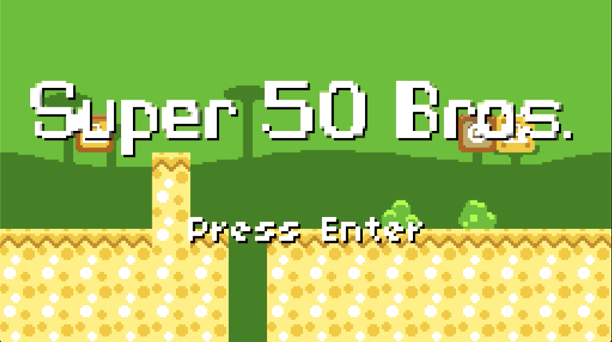
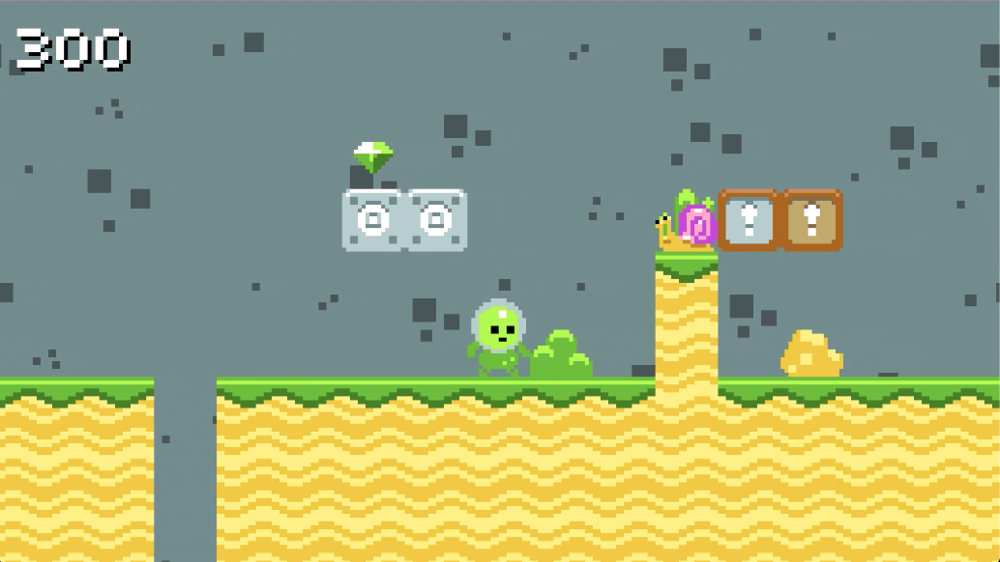

# Super 50 Bros.

Project 4 of [CS50's Introduction to Games Development](https://cs50.harvard.edu/games/2018/)

*Super 50 Bros.* is a clone of [Super Mario Bros.](https://en.wikipedia.org/wiki/Super_Mario_Bros.)  (1985) implemented in the [LÖVE2D](https://love2d.org/) game engine. For this assignment, we were tasked with adding a slew of new features to the game's [distribution code](https://cdn.cs50.net/games/2019/x/assignments/4/assignment4.zip) - all focused around the procedural level generation algorithm.


You can find a list of these features in the full [project specification](https://cs50.harvard.edu/games/2018/projects/4/mario/).

## Setup
First, clone this repository:
```bash
git clone https://github.com/calumbell/cs50g-super-50-bros
```
Install **LÖVE2D** (v10.2) - [click here for installation instructions](https://love2d.org/wiki/Getting_Started)

To run the game:
```bash
cd super-50-bros
love .
```

## Visuals

You can see a video demonstration of this project [here](https://youtu.be/5kuupoGBZyQ).






## Requirements

*Super 50 Bros* was built using [LÖVE2D](https://love2d.org/)  (10.2)

[Push](https://github.com/Ulydev/push) was used for resolution-handling, [hump](https://github.com/vrld/hump/blob/master/class.lua) was used for Lua object-orientation, and [Knife](https://github.com/airstruck/knife) was used to handle asynchronous code, chained functions, tweening, etc.
